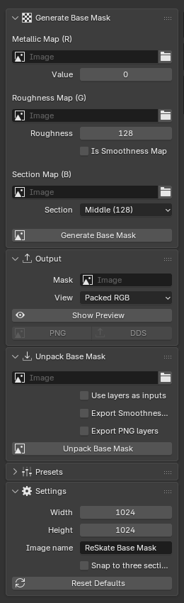
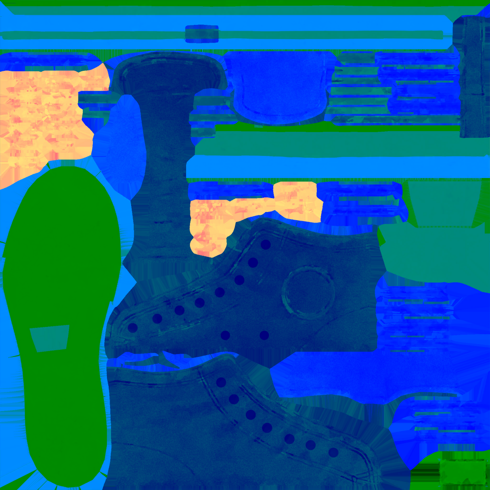
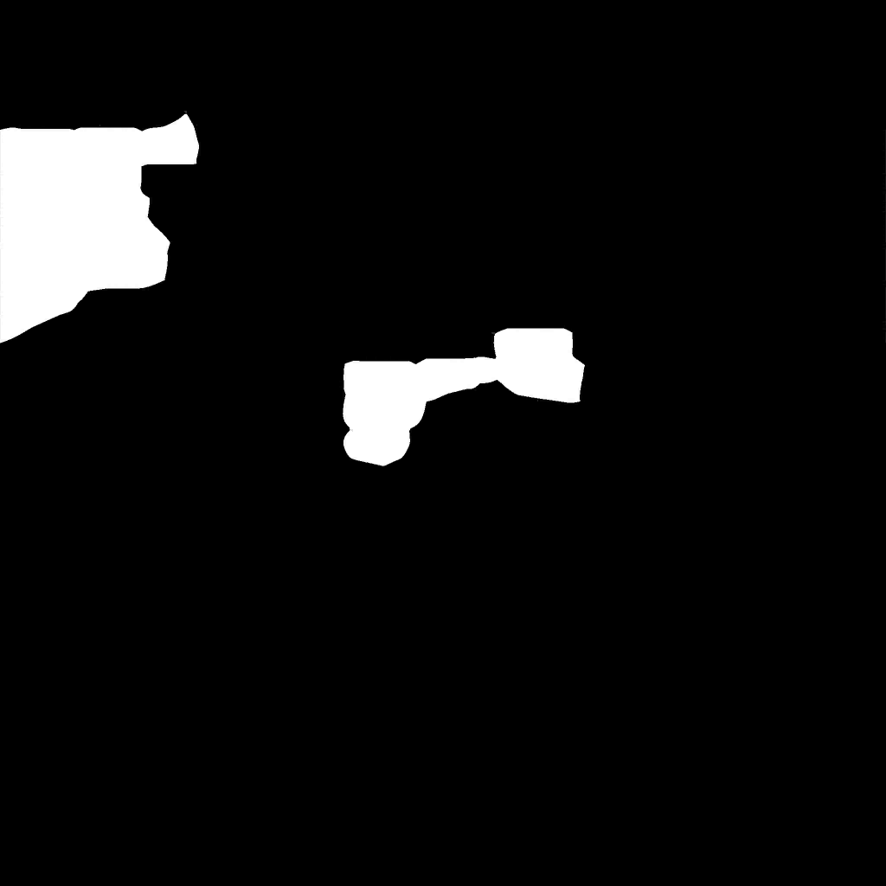
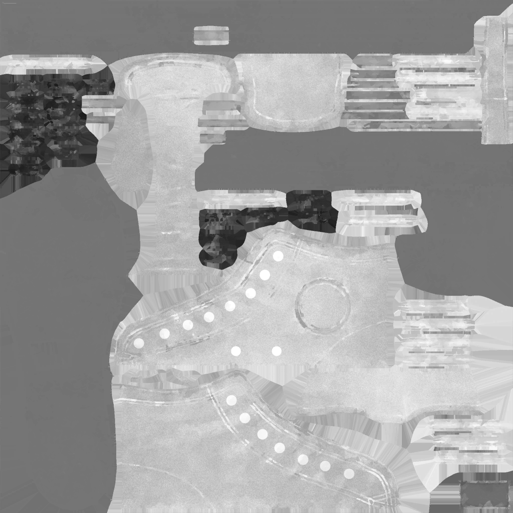
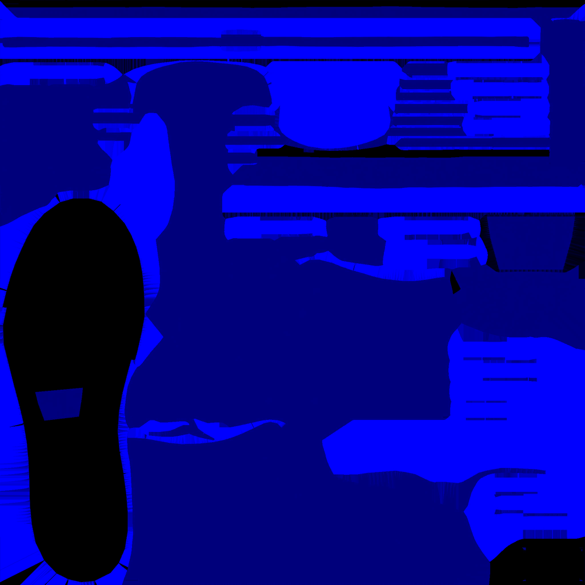

# ReSkate Base Mask Packer

A Blender extension for creating and editing **Skate / ReSkate clothing base masks**. No baking or complicated setup required!

With this extension, you can:

- **Create base masks** from metallic, roughness, and material-section maps.
- **Unpack existing base masks** into editable images.
- **Preview** individual texture channels.
- **Export** finished masks as PNG or DDS.
- **Save presets** to reuse settings.

## Installation

**Requires Blender 5.2 or newer.**

1. Download the extension ZIP from [Releases](https://github.com/donajello/ReSkate-Base-Mask-Packer/releases).
2. In Blender, go to **Edit > Preferences > Get Extensions**.
3. Open the menu in the top-right corner and select **Install from Disk**.
4. Select the ZIP file and enable the extension.
5. Open the **Image Editor**, press **N**, and select the **ReSkate** tab.

## What is a Base Mask?

A base mask is a texture that controls how different parts of a clothing item look. It stores three kinds of information in one image:

| Channel | What it controls |
| --- | --- |
| **Red** | Metalness — how metallic a surface is |
| **Green** | Smoothness — how smooth or rough a surface appears |
| **Blue** | Material sections — which areas use different materials |

The extension combines these channels automatically.

## Creating a Base Mask

1. Open **Generate Base Mask**.
2. Choose your **Metallic**, **Roughness**, and **Section** textures.
3. Set the output resolution under **Settings**.
4. Click **Generate Base Mask**.
5. Open **Output** to preview and export your mask.

**Don't have all three textures?** Leave an input empty to use a constant value instead.

**Tip:** Keep **Is Smoothness Map** and **Snap to three sections** off unless you specifically need them.

## Editing an Existing Base Mask

1. Open **Unpack Base Mask**.
2. Load an existing PNG or DDS mask.
3. Enable **Use layers as inputs**.
4. Click **Unpack Base Mask**.
5. Edit the extracted images in your preferred image editor.
6. Load your edited images and click **Generate Base Mask** to rebuild the mask.

### Example: Converse Shoe

**Original base mask**

**Extracted textures**

| Metallic | Roughness | Material Sections |
| --- | --- | --- |
|  |  |  |

**Rebuilt base mask**

The extension separates the mask into editable images, then combines them again.

## Exporting

In **Output**, choose:

- **PNG:** Lossless format, useful for editing and testing.
- **DDS:** Compressed game-texture format with mipmaps.

DDS export requires power-of-two dimensions, such as **512×512**, **1024×1024**, or **2048×2048**.

**Remember:** Click **Generate Base Mask** again after changing inputs, before exporting.

## Presets

Use **Presets** to save settings for other Blender projects. Presets do not store the textures themselves.

## Troubleshooting

- **Rebuilt mask looks different?** Turn off **Snap to three sections** and **Is Smoothness Map**, and keep the original resolution.
- **Section map looks black?** Set its source channel to **Blue**.
- **Export doesn't show changes?** Generate the mask again before exporting.
- **DDS won't export?** Use power-of-two dimensions such as 1024×1024.

## License

GPL-3.0-or-later. See [LICENSE](LICENSE).

This is an unofficial community tool and is not affiliated with EA, Frostbite, or the ReSkate developers. Example game textures remain the property of their respective owners.
